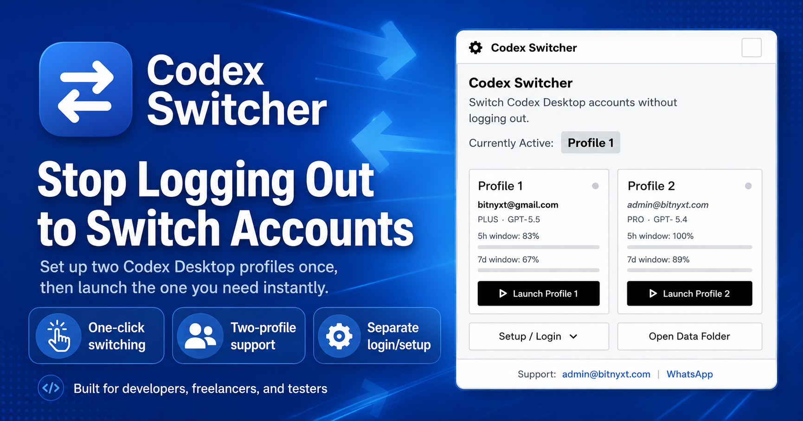
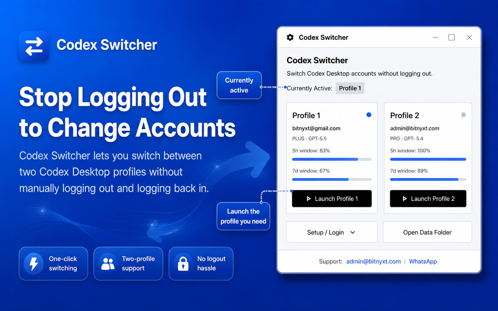
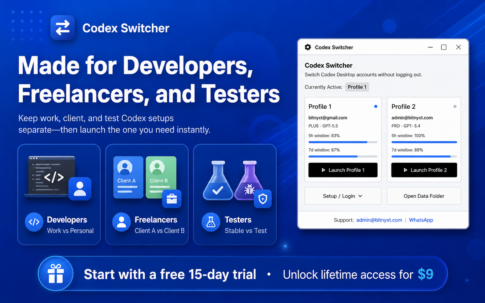
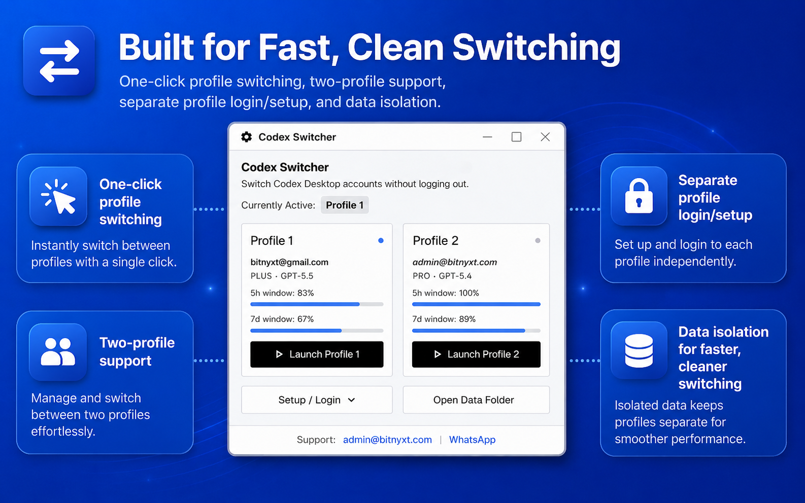

# Codex Profile Switcher

**Switch between up to four Codex Desktop accounts on Windows without manually logging out every time.**

Codex Profile Switcher is a small Windows desktop utility for developers, freelancers, agencies, and power users who work with more than one Codex account. It keeps each profile's Codex login data separated, then lets you launch the profile you need from a compact Windows app.

[Download Latest Release](https://github.com/qasimkhosa/Codex-Profile-Switcher/releases/latest) | [Buy License](https://buy.polar.sh/polar_cl_Waj8hduv5bF3RwBUVtl4f4xqwxyZd1AsgSEHs4aIX2B) | [Support](mailto:admin@bitnyxt.com)



## What It Does

- Switches Codex Desktop between **Profile 1**, **Profile 2**, **Profile 3**, and **Profile 4**.
- Keeps each profile's Codex login state in its own local profile folder.
- Shows account email, plan/model metadata, and available profile status where available.
- Includes setup/login actions for creating or refreshing each profile.
- Runs as a compact Windows utility with a system tray icon.
- Includes a 15-day trial, then requires a paid Polar license.

## Product Preview



Codex Profile Switcher is built around one practical workflow: set up each account once, then switch to the profile you need without repeating the logout/login process.



It is designed for developers, freelancers, and testers who need separate work, client, or testing profiles.



The app keeps the UI compact while making the main actions clear: launch a profile, set up login, or open the local data folder.

## Who It Is For

- Developers who use separate personal and work Codex accounts.
- Freelancers switching between client or agency accounts.
- Teams testing flows across more than one Codex login.
- Power users who want a faster workflow than repeated manual logout/login.

## Why Trust This Download

- Distributed through **GitHub Releases**, not random file hosting.
- Small, focused Windows utility with a clear purpose.
- No bundled adware, browser extensions, crypto miners, or background installers.
- License validation uses Polar's customer-facing license API.
- Trial validation uses a server-side trial record to reduce reinstall abuse.
- Support contact and product ownership are visible and consistent.

## Download And Install

1. Open the [latest GitHub Release](https://github.com/qasimkhosa/Codex-Profile-Switcher/releases/latest).
2. Download `CodexProfileSwitcher.zip`.
3. Extract the ZIP to a normal folder such as `Documents\Codex Profile Switcher`.
4. Run `CodexProfileSwitcher.exe`.
5. Use **Setup / Login** to configure Profile 1 through Profile 4.
6. Use the matching **Launch Profile** button to switch.

Windows SmartScreen may warn on first launch because this is a new independent utility. Confirm you downloaded it from this GitHub repository before running.

## Trial And Pricing

- Trial: **15 days**
- License: **$9 lifetime license**
- Purchase: [Polar Checkout](https://buy.polar.sh/polar_cl_Waj8hduv5bF3RwBUVtl4f4xqwxyZd1AsgSEHs4aIX2B)

During the trial, the Buy button is hidden and the app works normally. After the trial expires, switching and setup actions are disabled until a valid license key is entered.

## Security And Privacy

Codex Profile Switcher works with local Codex auth state. That means account data is sensitive and should stay on your own machine.

- The app does **not** ask for your ChatGPT or OpenAI password.
- The app does **not** require an OpenAI API key.
- The app does **not** upload your Codex auth files.
- The app stores profile data locally on your Windows machine.
- License/trial checks send a hardware-derived identifier, app version, and product ID to validate trial/license state.

Read the full documents:

- [Privacy Policy](PRIVACY.md)
- [Security Notes](SECURITY.md)
- [Support Policy](SUPPORT.md)

## File Verification

Latest release asset:

```text
CodexProfileSwitcher.zip
SHA256: DA6B4B5833F549E47CDE64ADDE5B12E7C8AD14ABB737386246D47C4134EE495B
```

After downloading, you can verify it in PowerShell:

```powershell
Get-FileHash .\CodexProfileSwitcher.zip -Algorithm SHA256
```

## Important Limitations

- This is a Windows utility.
- It is designed for four profiles.
- It switches local Codex Desktop login state; it does not run two active Codex accounts at the exact same time inside the same Windows user session.
- Close Codex before switching if Windows keeps the previous session locked.
- Do not share your local profile folder because it can contain sensitive login state.

## Support

- Email: [admin@bitnyxt.com](mailto:admin@bitnyxt.com)
- WhatsApp Support: [https://wa.me/923320505257](https://wa.me/923320505257)
- Website: [https://www.bitnyxt.com/projects](https://www.bitnyxt.com/projects)

For purchase/license issues, include your Polar checkout ID and purchase email.

## Product Status

Current release: `v1.0.0`

This public repository is the release and support page for Codex Profile Switcher. The downloadable build is published through GitHub Releases.
